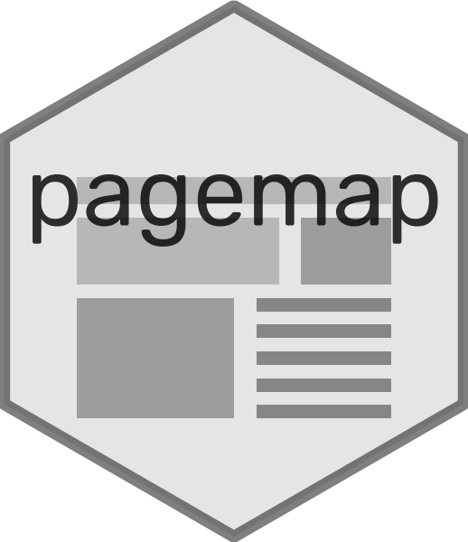

<!--
%\VignetteEngine{knitr::rmarkdown}
%\VignetteIndexEntry{Introduction to pagemap}
-->

pagemapR
========



<!-- badges: start -->

[](https://github.com/swsoyee/pagemapR/actions)
[](https://github.com/swsoyee/pagemapR)
<!-- badges: end -->

Introduction
------------

This is an R package that provides support for [`pagemap`](https://larsjung.de/pagemap/) as a [`htmlwidget`](http://htmlwidgets.org/).  
Quickly and easily add a mini map to your rmarkdown `html` documents.
See a demonstration [here](https://swsoyee.github.io/pagemapR/).

> Note: To distinguish it from the [original project `pagemap`](https://larsjung.de/pagemap/), the name of this project is `pagemapR`, but the package name is `pagemap`.

Installation
------------

`pagemapR` is not on CRAN now (may be later), you can use [`devtools`](https://www.r-project.org/nosvn/pandoc/devtools.html) to install the latest development version.

``` r
# install.packages("devtools")
devtools::install_github('swsoyee/pagemapR')
```

Usage
-----

It’s very simple to use.

``` r
pagemap::pagemap(id = "mini_map")
```

You could fix it’s position on the screen and style by providing a `list` of css property.

``` r
pagemap::pagemap(id = "mini_map",
                 box_style = list(left = "5px", top = "10px"))
```

You could also customize the internal style of the mini map through the API provided by [`pagemap`](https://larsjung.de/pagemap/).

``` r
pagemap::pagemap(
  id = "mini_map",
  styles = list(
    'h1,h2,a,code' = 'rgba(0,0,0,0.10)',
    'img' = 'rgba(0, 0, 0, 0.08)',
    'pre' = 'rgba(0,0,0,0.04)'
  )
)
```

Credit
------

This package is thanks to the work done by **Lars Jung** (<a href="https://github.com/lrsjng" class="uri">https://github.com/lrsjng</a>), the author of the original Javascript package `pagemap`. Also, thanks should also go to Ramnath Vaidyanathan, Kenton Russell, and RStudio, Inc. for the amazing work on create [`htmlwigets`](https://www.htmlwidgets.org/) package. The hex sticker of `pagemap`is produced by [`hexSticker`](https://github.com/GuangchuangYu/hexSticker) and [`ggplot2`](https://ggplot2.tidyverse.org/), so special thanks goes to the **Guangchuang YU** (<a href="https://guangchuangyu.github.io" class="uri">https://guangchuangyu.github.io</a>) and the `ggplot2` development team.

Contact
-------

You are welcome to:

-   Submit suggestions and bug-reports at:
    <a href="https://github.com/swsoyee/pagemapR/issues" class="uri">https://github.com/swsoyee/pagemapR/issues</a>
-   Send a pull request on: <a href="https://github.com/swsoyee/pagemapR" class="uri">https://github.com/swsoyee/pagemapR</a>
-   Compose a friendly e-mail to: <a href="mailto:swsoyee@gmail.com" class="email">swsoyee@gmail.com</a>

Code of Conduct
---------------

Please note that this project is released with a [Contributor Code of Conduct](https://github.com/swsoyee/pagemapR/blob/master/CODE_OF_CONDUCT.md). By participating in this project you agree to abide by its terms.
